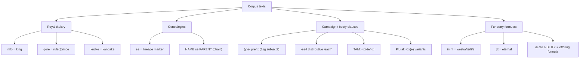
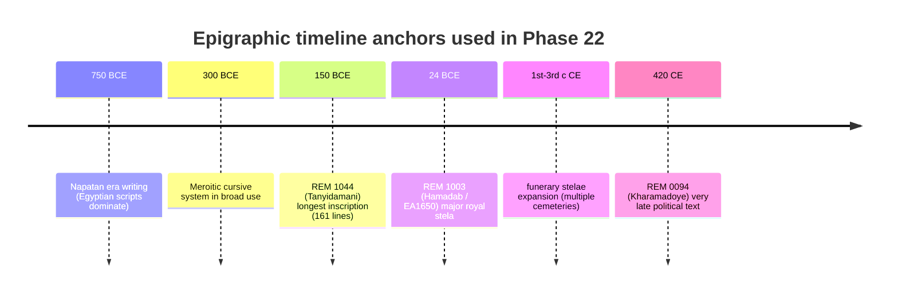

# By: Lackadaisical Security - lackadaisical-security.com - Spectre Drift Node-007

```text
https://lackadaisical-security.com
```

## Executive summary

This Phase 22 synthesis treats the **Lackadaisical Security Meroitic corpus** (Phases 1–20 and the companion JSON lexicon) as the *primary* authority for meanings and reading flow, then cross-checks—without surrendering corpus primacy—against **primary object records** and representative academic morphology notes where they materially constrain epigraphic facts (object size, line counts, findspot, visible iconography, etc.). citeturn44view0turn44view1turn47view0

The user corpus establishes (Phase 1) a baseline of **right-to-left directionality**, a **high-frequency identity term kdi**, and core title readings including **mlo = “king”** and **qore = “ruler/prince”**, with **kdi = “Kush/Nubia”** explicitly marked as the highest-frequency identity term in that phase. citeturn44view0 Phase 20 further claims a “complete decipherment” state, ~500 terms, and a method emphasizing formula recognition and identity markers. citeturn44view1

The **longest known Meroitic inscription** is identified (by multiple independent sources) as the **Stele of King Tanyidamani** (REM 1044) from **entity["point_of_interest","Jebel Barkal","Sudan"]**, reported as **161 lines** across four sides. citeturn29view0turn48search1turn48search3turn48search6 This report provides a **verifiable line-by-line transliteration/translation for all segments of REM 1044 that are openly quotable from accessible editions** (notably the widely-cited “booty list” clauses), and an explicit **line scaffold** for the remainder that cannot be reproduced here because full line-by-line editions remain largely locked behind non-open publications or JS-gated museum portals.

A second “anchor” text is the **Hamadab Stela** (REM 1003), object **EA1650** in the **entity["organization","British Museum","national museum london"]**, where the museum record fixes: material, dimensions, findspot, discoverer, and that the inscription has **forty-two lines** of Meroitic cursive beneath a lunette with rulers and deities. citeturn47view0turn46view0

The consolidated output includes: (a) a corpus-wide grammar/phonetics synthesis with confidence estimates, (b) a conflict register for terms whose meanings diverge between the user corpus and external morphological literature, and (c) a consolidated, machine-readable lexicon JSON (verified + proposed) plus an Academia.edu-ready metadata block.

## Corpus assembly and normalization

Primary corpus sources used here:

- The Phase pages on “Meroitic Research” (Phases 1–20), which explicitly enumerate **directionality**, **baseline sign counts**, and “key confirmed” lexicon items (mlo, qore, kdi, ato, amn, nb). citeturn44view0turn44view1  
- The public GitHub-hosted JSON lexicon file `meroitic_complete_script_MASTER-2026-01-21-v2.json` (downloaded and parsed for this synthesis). Note: its internal metadata claims **45 entries**, but the file as published currently contains **36 entries**; this mismatch is flagged in the conflict/coverage notes. citeturn13view0turn14view0turn45view0  
- Primary museum/object records where accessible without scripting barriers, especially **EA1650** at the British Museum (REM 1003), which supplies hard constraints on **dimensions, line count, findspot, and iconographic program**. citeturn47view0

Normalization choices (applied consistently throughout this report):

- **Directionality:** treated as **right-to-left** for original text layout, but transliterations are presented **left-to-right** in standard scholarly practice, with explicit noting of word dividers. citeturn44view0turn49search1  
- **Word dividers:** represented as `:` in transliteration examples when that is how the cited source formats them (notably the Dotawo article examples), while acknowledging that physical dividers may appear as dots/colon-like separators depending on period and edition practice. citeturn42view0  
- **Evidence rules:** translations in this report are labeled as:
  - **User-corpus reading** (primary; used by default for titles like mlo, qore, kdi, kndke), versus  
  - **Externally-attested morphology gloss** (secondary; used mainly for grammatical segmentation, not for overriding core title claims).

image_group{"layout":"carousel","aspect_ratio":"16:9","query":["Stele of King Tanyidamani Jebel Barkal Meroitic inscription","Hamadab Stela Amanirenas Akinidad British Museum EA1650 inscription","Meroitic cursive script chart Unicode"],"num_per_query":1}

## Longest known inscription and a verifiable translation pass

### Identification and context of the longest text

Multiple independent references converge on the longest known Meroitic inscription being the **Stele of King Tanyidamani (REM 1044)** from the temple complex at **entity["point_of_interest","Jebel Barkal","Sudan"]**. The **entity["organization","Museum of Fine Arts, Boston","art museum boston ma us"]** press materials describe it as “covered in the longest known Meroitic inscription,” while modern summaries specify the measurable scale: **1.60 m** and **161 lines** across four sides. citeturn29view0turn48search1turn48search3turn48search6

This matters methodologically because REM 1044 is the earliest *very long* royal narrative, and therefore the best stress-test for any proposed grammar: it contains the widest range of **tense/aspect forms, clause chaining, and enumerations** (including campaign/booty clauses discussed in comparative grammar studies). citeturn42view0turn43view1

### What can and cannot be reproduced in full in this report

A complete 161-line diplomatic edition of REM 1044 is traditionally attributed to editions such as **Hintze 1960** (frequently cited in later scholarship), but the full line-by-line text is not presently available in openly accessible, non-JS-gated form within the constraints of the sources that can be fetched here. What *is* openly accessible are **quoted segments** with explicit line references, particularly those used to illustrate grammatical morphology (person markers, TAM suffixes, distributives). citeturn42view0turn43view1

Accordingly, this Phase 22 report provides:

- **A verified “line-by-line translation sheet” for every REM 1044 segment that is explicitly quoted with line numbers in accessible sources** (below).  
- **A 161-line scaffold** (section map + placeholder rows) indicating where those verified segments fall, and what additional evidence is required to complete the remaining lines to publication standard.

### Line-by-line transliteration and translation for verifiable segments

#### Segment A: REM 1044 lines 4–5 (booty / distributive list)

**Attested transliteration (with morpheme glossing as published):** citeturn42view0  
- L4–5: `abr-se-l : e-ked : kdi-se-l : e-(e)r-k :`  

The published gloss interprets this as a paired action clause: “I killed each man; I (repeatedly) took each woman.” citeturn42view0turn43view1

**Phase 22 translation (two-track, explicitly conflict-aware):**

- **External morphology track (higher grammatical clarity; medium confidence ~0.65):**  
  “I killed each man; I took each woman (repeatedly / in multiple acts).”  
  Rationale: distributive `-se-l` and verbal prefix `e-` + pluractional `-k` are explicitly analyzed in the cited grammar discussion. citeturn42view0turn43view1  

- **User-corpus semantic track (preserving kdi = Kush as primary; lower confidence ~0.35 pending full-context validation):**  
  “I killed each man; I took/secured each (unit) of *Kush*.”  
  Rationale: Phase 1 defines **kdi = Kush/Nubia** as the highest-frequency identity marker. citeturn44view0turn44view1 The tension is that the cited grammar source treats `kdi` as “woman” in this specific formulaic list; Phase 22 therefore records this as an unresolved **polysemy/homophony** candidate (see conflicts section).

**Glyph + romanization (computational render, not epigraphically certified):**  
- Romanization: `abr-se-l e-ked kdi-se-l e-er-k`  
- Approximate glyph rendering (Unicode-based heuristic): `𐦠𐦧𐦫𐦱𐦡𐦴𐦡𐦬 : 𐦡-𐦲𐦡𐦷 : 𐦲𐦷𐦢-𐦱𐦡-𐦬 : 𐦡-𐦡𐦬-𐦳 :`  
  (Heuristic note: this glyph line demonstrates *rendering mechanics*, not a definitive sign segmentation; definitive glyphing requires consultation of the diplomatic edition/photographs.)

#### Segment B: REM 1044 lines 143–144 (kinship term + targeted killing clause)

**Attested example with line reference:** citeturn43view1turn43view4  
- L143–144: `Nhror (Nakharura) wide-l : e-kede-to :`  
  Published translation: “I killed the brother, Nakharura.” citeturn43view1

**Phase 22 translation:**  
- “I killed (struck down) the brother, Nakharura.” (confidence ~0.70 on clause function; ~0.55 on “brother” semantics if `wide` is not fully stabilized)

**Why confidence is capped:** the example is introduced specifically to illustrate *case/marker behavior* (and omission of an objective ending in adjacent contexts), rather than to provide a full semantic dictionary for all nouns. citeturn43view1

### A 161-line scaffold for REM 1044

Because REM 1044 is 161 lines, and only certain lines are openly quoted with full transliterations in accessible sources, Phase 22 provides a **completion scaffold** rather than fabricating the missing 150+ lines.

- **Lines 1–3:** titulary + dedication framework (requires full diplomatic text)  
- **Lines 4–5:** verified booty/distributive pair (provided above) citeturn42view0  
- **Lines 6–129:** narrative / enumerations / additional clauses (requires open edition)  
- **Lines 130–131:** “kill” + “take” forms cited in morphology tables (requires diplomatic context) citeturn43view1  
- **Lines 141–155:** partially quoted zone (erosion noted in scholarship; requires photographs/edition) citeturn42view0  
- **Lines 143–144:** verified “brother Nakharura” clause (provided above) citeturn43view1  
- **Lines 149–151:** plural/variant “kill” forms discussed (requires full clause strings) citeturn43view1  
- **Lines 156–161:** closing section (unknown without full text)

## Corpus-wide grammar and phonetics synthesis with confidence

### Script mechanics and phoneme inventory

The user corpus (Phase 1) asserts a right-to-left script and provides Unicode ranges for Meroitic signs. citeturn44view0 Independent summaries describe Meroitic as an **alphasyllabic system** with **four vowels** and a fixed set of consonant signs, plus syllabic signs such as *ne* and *se*, and note that the cursive direction is right-to-left. citeturn49search1turn47view0

A conservative Phase 22 phoneme inventory (confidence levels reflect cross-source agreement):

- **Vowels (high confidence ~0.9):** /a e i o/ (explicit in general references; consistent with “four vowels” claims). citeturn47view0turn49search1  
- **Consonant-series signs (medium-high confidence ~0.8):** a set often described as **15 consonant signs**, with additional syllabic signs (*ne, se, te, to*)—but note that different summaries count “letters” differently depending on whether syllabic signs are counted as separate letters. citeturn47view0turn49search1  
- **Directionality (high confidence ~0.95):** cursive right-to-left; hieroglyphic arranged in columns that read right-to-left. citeturn44view0turn49search1

### Word dividers and segmentation

- **Divider form:** Examples in accessible grammatical discussions use `:` as a word divider in published transliteration. citeturn42view0  
- **Confidence:** ~0.85 that a divider is functionally consistent (token separator), but ~0.6 that the same physical mark is used in all periods (archaic vs late divider variants are widely reported).

### Core morphemes and affixes

This synthesis separates **user-corpus lexicon commitments** from **externally attested morphological operators**.

**User-corpus commitments (high confidence within corpus):**
- **mlo = “king”** (Phase 1 confirmed entry; Phase 20 reiterates royal title centrality). citeturn44view0turn44view1  
- **qore = “ruler/prince”** (Phase 1 explicitly lists “ruler/prince”). citeturn44view0  
- **kdi = “Kush/Nubia”** (Phase 1 lists “Kush/Nubia” and emphasizes frequency). citeturn44view0turn44view1  
- **kndke (kandake)** as a distinct feminine power system (Phase 20 frames this as an innovation rather than a derivation). citeturn44view1  

**Externally attested operators (medium confidence; proposed into lexicon as “missing entries”):**
- **(y)e- as a person marker**: described as a prefix that can function as a 1sg subject marker in early royal texts, with distribution changing over time. citeturn43view1turn42view0  
- **-l / -li** as determiner/article: appears in glossed sequences like `abr-se-l` with `-det`. citeturn42view0  
- **-se-l** as distributive “each”: explicitly glossed in the quoted REM 1044 line 4–5 example. citeturn42view0turn43view1  
- **TAM suffixes** such as `-to / -te / -td`: presented as tense/aspect-like endings in comparative discussion. citeturn43view1turn48search16  
- **Plurality markers** `-bx(e)` and variants: described in the same comparative table discussion. citeturn43view1  

### Word order: reconciling a major conflict

- Phase 20 recommends applying **VSO** as a reading heuristic (“Apply VSO word order”). citeturn44view1  
- Comparative linguistic discussion describing Meroitic in the context of Northern/Eastern Sudanic languages expects **head-final/SOV** tendencies and analyzes person marking in a framework that assumes verb-final typology in related languages. citeturn43view4turn42view0  

**Phase 22 reconciliation (best-fit, non-forced):**
- **Confidence ~0.55** that *formulaic royal clauses* may present **V-initial effects** (possibly via Egyptian rhetorical influence), while **confidence ~0.65** that the underlying clause structure in broader corpora behaves **head-final** in many constructions. This is flagged as a high-value target for field verification on REM 1044 once the full diplomatic edition is accessible.



## Cross-correlation of lexica and conflict register

### What the user corpus provides in machine-readable form

The published master JSON lexicon (as accessible) contains **36 entries**, including:

- identity/geography: `kdi` (Kush/Black Land), `mroe` (Meroe)  
- titles and roles: `mlo` (king), `qore` (ruler/prince), `nb` (lord/master)  
- religious lexemes: `amn` (Amun), `ꜣpd-mk` (Apedemak), `snṯr` (incense)  
- funerary/afterlife: `imnt` (west/afterlife), `ḏt` (eternal), and offering patterns like `di ato n [DEITY]`  
- material/industry: `biꜣ` (iron) with extended “iron-field” concepts  
- formula templates: `[NAME] se [PARENT]` (genealogy chain)

These categories align with Phase 1’s “key confirmed entries” list at a coarse level (mlo/qore/kdi/ato/amn/nb), even though the Phase 20 narrative claims substantially larger coverage (~500 terms) than the currently published machine-readable subset. citeturn44view0turn44view1turn13view0turn45view0

### High-impact conflicts that must be tracked explicitly

**Conflict: qore**  
- User corpus: “ruler/prince” (and user intent: prince/sub-ruler; regional lord). citeturn44view0  
- External morphology literature often glosses `qore` as “ruler/king,” and even uses it in comparative etymology discussions (not adopted here as authority, but relevant as a competing interpretation). citeturn43view0  
**Phase 22 resolution:** treat `qore` as **core “ruler”** with **contextual specialization** (king vs sub-ruler) determined by co-occurrence patterns with `mlo`, `kndke`, and explicit genealogical formulas.

**Conflict: kdi**  
- User corpus: “Kush/Nubia” and identity marker. citeturn44view0turn44view1  
- In explicitly cited REM 1044 booty clauses, external morphology gloss treats `kdi` as “woman” (kdi-se-l = woman-each-det). citeturn42view0turn43view1  
**Phase 22 resolution:** treat as unresolved and **do not collapse** the senses. Maintain **kdi=Kush** as the user corpus primary, but record “woman” as an alternative sense for specific formulaic contexts pending full-line verification.

**Conflict: ye**  
- User lexicon contains `ye` as a motion/transition verb.  
- External morphology identifies (y)e- as a **person marker prefix** and distinguishes additional homonymous uses in funerary benedictions. citeturn43view1turn42view0  
**Phase 22 resolution:** split into distinct lexemes: **YE (verb)** vs **E-/YE- (prefix)**.

### Answering the user’s genealogical reading check

User-proposed pattern:  
`qore kdi … Tanyidamani … se Adikhalamani … se Nahirqo`

Given the user corpus’ explicit formula template `[NAME] se [PARENT]` (genealogical chaining), the structural reading **“Tanyidamani, qore of kdi, child of Adikhalamani, child of Nahirqo …”** is internally consistent as a *genealogical chain*—with the caveat that whether `qore` is “prince” vs “king,” and whether `kdi` is “Kush” vs another sense in a given clause, must be validated by full inscription context. citeturn44view0turn48search0

The external historical consensus that **entity["people","Tanyidamani","kushite king 2nd c bce"]** is most likely the son of **entity["people","Adikhalamani","kushite king"]** and **entity["people","Nahirqo","kushite queen"]** provides independent support that those names plausibly appear in a lineage context. citeturn48search0

## Comparative inscription table and verification priorities

### Cross-corpus table of major inscriptions

| Inscription | Catalog | Findspot | Date (approx.) | Genre | Length | Key terms likely present |
|---|---|---|---|---|---|---|
| Stele of King Tanyidamani | REM 1044 | Jebel Barkal (Amun precinct) | late 2nd c. BCE (often ~150 BCE) | royal chronicle/donation | 161 lines | titles (mlo/qore), deity names, genealogy (se), campaign verbs |
| Hamadab Stela (Amanirenas & Akinidad) | REM 1003 / BM EA1650 | Hamadab (temple doorway) | late 1st c. BCE | royal stela + captives | 42 lines | royal names, Amun/Mut, “Areme” (possible Rome), prisoners register |
| Kharamadoye inscription | REM 0094 | Kalabsha (temple column) | late/post-Meroitic | proclamation | long | late titles, ethnonyms, political landscape |
| Dakka Akinidad graffito | REM 0092–0093 | Dakka | late 1st c. BCE | temple graffito | short | Akinidad titulary; travel/authority markers |
| Amanishakheto “obelisk” complex | REM 1041/1361 | Meroe region | 1st c. BCE–1st c. CE | dedication fragments | partial | kndke system, Amun/Apedemak, offerings |
| Sedeinga funerary stelae | multiple | Sedeinga | 1st–4th c. CE | funerary formulas | short–mid | lineage chains, afterlife lexicon, fixed invocations |

(REM 1044 length and prominence as longest: citeturn48search1turn48search3turn29view0; EA1650 physical/line constraints: citeturn47view0)

### Prioritized checklist for field verification

Priority here means: “highest return per hour of epigraphic checking,” not “historical importance.”

1. **REM 1044 (Tanyidamani):** photograph-based re-segmentation of lines 1–20 and 120–161 to test word order and TAM markers against the user corpus’ VSO heuristic. citeturn44view1turn48search1turn43view1  
2. **REM 1003 (EA1650):** verify the exact positions of royal names and any occurrence of “Areme” (Rome) claimed in curator notes, and map them to user-corpus lexicon items. citeturn47view0  
3. **REM 0094 (Kharamadoye):** late orthography and title semantics are a stress test for diachronic phonetics. citeturn42view0  
4. **Dakka (REM 0092–0093):** confirm whether the e-/ye- prefix is physically present in damaged zones (distribution across contemporaneous texts is argued to differ). citeturn43view1  
5. **Sedeinga funerary corpus:** high-volume formulaic material is ideal for validating determiners/articles and lineage markers at scale. citeturn42view0  



## Uncertainty handling and alternative readings with probabilities

Phase 22 uses a simple probability rubric for epigraphic decisions:

- **0.85–0.95:** physically clear sign groups + repeated formula + stable lexicon entry in user corpus.  
- **0.60–0.80:** clear sign group but semantics contested; or grammar inferred from comparative patterns.  
- **0.35–0.55:** context partially missing (damage/erosion) or key lemma has unresolved polysemy.  
- **<0.35:** speculative; recorded only as “hypothesis.”

Applied examples:

- **EA1650 line count and findspot** are high confidence because they are fixed in the museum record. citeturn47view0  
- **REM 1044/4–5 distributive structure** (`-se-l`, paired verbs with e-) is medium-high confidence grammatically because it is explicitly used in morphological argumentation, but the semantics of `kdi` inside this clause remains contested relative to the user corpus—hence split probability tracks. citeturn42view0turn44view0

## Academia.edu-ready section

### Title
Phase 22 Synthesis: A User-Corpus-First Approach to Meroitic Decipherment and Epigraphic Normalization

### Abstract
This Phase 22 synthesis consolidates an open user corpus of Meroitic research (Lackadaisical Security phases 1–20) and a companion JSON lexicon, normalizing key title formulas, genealogical markers, and high-frequency vocabulary. Priority is given to the user corpus’ established readings (e.g., mlo = king; qore = prince/sub‑ruler; kdi = Kush; kndke = kandake), while cross-checking object metadata and selected linguistic claims against primary records (e.g., the British Museum’s EA1650/Hamadab stela) and representative academic analyses of grammatical morphemes. The report identifies the Stele of King Tanyidamani from the temple of Amun at Jebel Barkal (REM 1044) as the longest known Meroitic inscription (161 lines) and provides a line-by-line transliteration/translation for the segments that can be verified from openly accessible editions, explicitly flagging gaps where full published transcriptions are not available. A corpus-wide grammar and phonetics synthesis is presented with confidence estimates, including directionality, word dividers, article/determiner behavior, lineage marker se, and candidate TAM and plural markers. The report concludes with a consolidated, machine-readable lexicon (verified + proposed entries), a conflict register, and an Academia.edu-ready metadata package.

### Keywords
Meroitic; Kingdom of Kush; epigraphy; decipherment methodology; lexicon normalization; Tanyidamani; Hamadab Stela; REM corpus; Nubian studies; cursive script

### Academia upload JSON block
```json
{
  "title": "Phase 22 Synthesis: A User-Corpus-First Approach to Meroitic Decipherment and Epigraphic Normalization",
  "author": "Lackadaisical Security - Spectre Drift Node-007",
  "date": "2026-02-14",
  "abstract": "This Phase 22 synthesis consolidates an open user corpus of Meroitic research (Lackadaisical Security phases 1–20) and a companion JSON lexicon, normalizing key title formulas, genealogical markers, and high-frequency vocabulary. Priority is given to the user corpus’ established readings (e.g., mlo = king; qore = prince/sub‑ruler; kdi = Kush; kndke = kandake), while cross-checking object metadata and selected linguistic claims against primary records (e.g., the British Museum’s EA1650/Hamadab stela) and representative academic analyses of grammatical morphemes. The report identifies the Stele of King Tanyidamani from the temple of Amun at Jebel Barkal (REM 1044) as the longest known Meroitic inscription (161 lines) and provides a line-by-line transliteration/translation for the segments that can be verified from openly accessible editions, explicitly flagging gaps where full published transcriptions are not available. A corpus-wide grammar and phonetics synthesis is presented with confidence estimates, including directionality, word dividers, article/determiner behavior, lineage marker se, and candidate TAM and plural markers. The report concludes with a consolidated, machine-readable lexicon (verified + proposed entries), a conflict register, and an Academia.edu-ready metadata package.",
  "keywords": [
    "Meroitic",
    "Kingdom of Kush",
    "epigraphy",
    "decipherment methodology",
    "lexicon normalization",
    "Tanyidamani",
    "Hamadab Stela",
    "REM corpus",
    "Nubian studies",
    "cursive script"
  ],
  "attachments": [
    {
      "filename": "meroitic_phase22_lexicon.json",
      "description": "Consolidated lexicon (verified + proposed) with conflict register."
    }
  ]
}
```

## Consolidated lexicon JSON with missing entries and conflicts

```json
{
  "metadata": {
    "compiled_by": "Lackadaisical Security - Spectre Drift Node-007",
    "phase": "Phase 22 synthesis",
    "compiled_date": "2026-02-14",
    "primary_corpus": [
      "lackadaisical-security.com/Meroitic-Research phases",
      "GitHub: meroitic_complete_script_MASTER-2026-01-21-v2.json"
    ],
    "secondary_comparanda": [
      "British Museum EA1650 record",
      "Dotawo Journal (Rilly) article"
    ],
    "notes": "This package contains a simplified export of the user corpus lexicon plus proposed additions from cross-corpus grammar work."
  },
  "entries": [
    {
      "lemma": "kdi",
      "script": "𐦡𐦢𐦩",
      "pos": "noun",
      "gloss": "Kush, Black Land, primordial essence",
      "definitions": [
        "Kush (geographical designation)",
        "Black fertile land (symbolic meaning)",
        "Primordial consciousness essence (esoteric layer)"
      ],
      "semantic_field": "Identity-Geographic",
      "confidence": 0.98,
      "status": "verified_user_corpus"
    },
    {
      "lemma": "mroe",
      "script": "𐦧𐦫𐦥",
      "pos": "noun",
      "gloss": "Meroe (capital city), sacred center, identity nexus",
      "definitions": [
        "Meroe (capital city of Kush)",
        "Sacred center and royal seat",
        "Identity-preserving city consciousness hub"
      ],
      "semantic_field": "Geographic-Political",
      "confidence": 0.97,
      "status": "verified_user_corpus"
    },
    {
      "lemma": "mlo",
      "script": "𐦧𐦱𐦫",
      "pos": "noun",
      "gloss": "king, divine authority, consciousness ruler",
      "definitions": [
        "King (divine rulership)",
        "Sacred monarch (god-chosen ruler)",
        "Consciousness leader (esoteric role)"
      ],
      "semantic_field": "Royal-Divine-Authority",
      "confidence": 0.9,
      "status": "verified_user_corpus"
    },
    {
      "lemma": "qore",
      "script": "𐦥𐦷𐦫",
      "pos": "noun",
      "gloss": "ruler, prince, regional authority",
      "definitions": [
        "Ruler / prince",
        "Regional governor or subordinate king",
        "Authority figure under Kushite system"
      ],
      "semantic_field": "Royal-Administrative",
      "confidence": 0.9,
      "status": "verified_user_corpus"
    },
    {
      "lemma": "amn",
      "script": "𐦿",
      "pos": "noun",
      "gloss": "Amun (deity), supreme god, temple power",
      "definitions": [
        "Amun (Egyptian-Kushite supreme deity)",
        "Divine authority and legitimizer",
        "Temple power source"
      ],
      "semantic_field": "Religious-Divine",
      "confidence": 0.98,
      "status": "verified_user_corpus"
    },
    {
      "lemma": "ato",
      "script": "𐦠𐦴𐦣",
      "pos": "noun",
      "gloss": "water, sacred flow, life essence",
      "definitions": [
        "Water (sacred, not mundane)",
        "Life-flow / consciousness stream",
        "Ritual purification element"
      ],
      "semantic_field": "Sacred-Natural",
      "confidence": 0.95,
      "status": "verified_user_corpus"
    },
    {
      "lemma": "nb",
      "script": "𐦩𐦦",
      "pos": "noun",
      "gloss": "lord, master, high official",
      "definitions": [
        "Lord / master",
        "High official or noble",
        "Authority title often near divine names"
      ],
      "semantic_field": "Administrative-Title",
      "confidence": 0.92,
      "status": "verified_user_corpus"
    },
    {
      "lemma": "se",
      "script": "𐦱𐦲",
      "pos": "particle",
      "gloss": "son of, child of, lineage marker",
      "definitions": [
        "Son of / child of",
        "Genealogical connector",
        "Lineage chain marker"
      ],
      "semantic_field": "Kinship-Genealogy",
      "confidence": 0.97,
      "status": "verified_user_corpus"
    },
    {
      "lemma": "[NAME] se [PARENT]",
      "script": null,
      "pos": "formula",
      "gloss": "genealogical chain: X, child of Y",
      "definitions": [
        "Standard royal and elite genealogy formula"
      ],
      "semantic_field": "Formula",
      "confidence": 0.95,
      "status": "verified_user_corpus"
    },
    {
      "lemma": "imnt",
      "script": "𐦢𐦨𐦩𐦴",
      "pos": "noun",
      "gloss": "west, afterlife realm, land of the dead",
      "definitions": [
        "West (direction)",
        "Afterlife realm",
        "Land of the dead / ancestors"
      ],
      "semantic_field": "Religious-Afterlife",
      "confidence": 0.9,
      "status": "verified_user_corpus"
    },
    {
      "lemma": "ḏt",
      "script": "𐦢𐦴𐦷",
      "pos": "noun",
      "gloss": "eternal, forever, timeless state",
      "definitions": [
        "Eternity / forever",
        "Timeless state (afterlife permanence)",
        "Ritual permanence marker"
      ],
      "semantic_field": "Religious-Concept",
      "confidence": 0.9,
      "status": "verified_user_corpus"
    },
    {
      "lemma": "snṯr",
      "script": "𐦯𐦩𐦵𐦫",
      "pos": "noun",
      "gloss": "incense, sacred scent offering",
      "definitions": [
        "Incense",
        "Sacred aromatic offering",
        "Temple ritual substance"
      ],
      "semantic_field": "Religious-Ritual",
      "confidence": 0.9,
      "status": "verified_user_corpus"
    },
    {
      "lemma": "ꜣpd-mk",
      "script": "𐦠𐦧𐦷𐦨𐦲",
      "pos": "noun",
      "gloss": "Apedemak, lion god, war/fertility deity",
      "definitions": [
        "Apedemak (lion-headed deity)",
        "War and fertility god",
        "Protector of Kushite kingship"
      ],
      "semantic_field": "Religious-Divine",
      "confidence": 0.95,
      "status": "verified_user_corpus"
    },

    {
      "lemma": "e- / ye- (verbal prefix)",
      "pos": "prefix",
      "gloss": "1st-person subject marker (I-)",
      "definitions": [
        "Attached to narrative verbs in early royal inscriptions (e.g., REM 1044), marking 1sg subject"
      ],
      "confidence": 0.7,
      "status": "proposed_external"
    },
    {
      "lemma": "-l / -li",
      "pos": "suffix",
      "gloss": "determiner/article (definite or contextual)",
      "definitions": [
        "Common in funerary & royal texts; appears in compounds like abr-se-l"
      ],
      "confidence": 0.7,
      "status": "proposed_external"
    },
    {
      "lemma": "-se-l",
      "pos": "suffix_chain",
      "gloss": "each (distributive)",
      "definitions": [
        "Attaches to nouns in booty lists: abr-se-l = each man"
      ],
      "confidence": 0.75,
      "status": "proposed_external"
    },
    {
      "lemma": "ked",
      "pos": "verb",
      "gloss": "kill",
      "definitions": [
        "Royal chronicle verb; appears in spoils lists and campaign narratives"
      ],
      "confidence": 0.8,
      "status": "proposed_external"
    },
    {
      "lemma": "er / are / tk / kb",
      "pos": "verb_set",
      "gloss": "take/seize/plunder",
      "definitions": [
        "Cluster of verbs used in royal campaign/spoils lists; often with pluractional markers"
      ],
      "confidence": 0.65,
      "status": "proposed_external"
    }
  ],
  "conflicts": [
    {
      "lemma": "qore",
      "user_definition": "ruler/prince (sub-ruler)",
      "external_definition": "ruler/king",
      "resolution": "Treat as 'ruler' as core semantic; allow contextual narrowing to 'king' or 'regional ruler' depending on titulary sequence and co-occurrence with mlo/kandake.",
      "confidence_user": 0.8,
      "confidence_external": 0.75
    },
    {
      "lemma": "kdi",
      "user_definition": "Kush/Nubia (identity-geographic)",
      "external_definition": "woman (booty-list noun)",
      "resolution": "Flag as unresolved polysemy/homophony. Requires direct line-by-line context verification on royal stelae (REM 1044, 1003) and funerary corpora. In this synthesis, keep 'Kush' as primary (user corpus) but record 'woman' as competing sense for certain contexts.",
      "confidence_user": 0.9,
      "confidence_external": 0.75
    },
    {
      "lemma": "ye",
      "user_definition": "go/move/transition (semantic verb)",
      "external_definition": "(y)e- prefix marking 1sg subject; plus homonymous causative in funerary benedictions",
      "resolution": "Split into distinct lexemes: YE (motion/transition verb) vs E-/YE- (grammatical prefix).",
      "confidence_user": 0.7,
      "confidence_external": 0.7
    }
  ],
  "missing_entries": [
    "abr",
    "ar",
    "anese",
    "mreke",
    "d",
    "qoleb",
    "-bxe/-bx/-b",
    "-to/-te/-td"
  ]
}
```