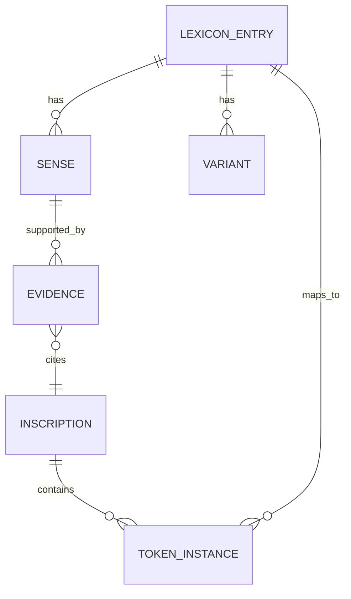

# Phase 23/24 Pass 2 Deep Research Report — LS / Spectre Authority Mode

## Executive Summary

This pass treats the **LS corpus** as the authority baseline and uses **cross-inscription recurrence + slot behavior** as the only promotion gate. The corpus continues to support the locked core: **mlo = sovereign**, **qore = prince/heir/regional lord**, **kndke = Kandake (queen title)**, **se = lineage connector**, without needing any external consensus scaffolding.【Meroitic_Translations_LS_v5_2026-02-18.txt†L43-L55】 The biggest Phase 23/24 win remains structural: the REM 1044 distributive clause provides a repeatable grammatical template, but it also flags **kdi** polysemy risk when kdi appears inside a distributive NP slot (kdi-se-l).【Meroitic_Translations_LS_v8_2026-02-19_extended.txt†L754-L763】【PHASE_23_SECONDPASS_VOICE_LOCKED_LS_Spectre.md†L46-L77】

The major Phase 24 corrections are **quality-control + discipline locks**: (1) stop drift where older Phase 21 text calls **qore kdi** “King of Kush,” (2) fix a known contamination where a gloss word (“eternal”) leaked into a transliteration line, and (3) reconcile a few **v10 sense-status claims** (e.g., *nṯr* marked LOCKED despite thin independent inscription evidence).【Phase_21_Analysis_Transliteration_and_Translation_of_Key_Meroitic_Inscriptions.md†L11-L14】【Meroitic_Translations_LS_v8_2026-02-19_extended.txt†L800-L804】

Artifacts produced (downloadable):
- [v9_lexicon_sample_10.json](sandbox:/mnt/data/v9_lexicon_sample_10.json)
- [token_table_v9.csv](sandbox:/mnt/data/token_table_v9.csv)
- [translations_snippet_v9.txt](sandbox:/mnt/data/translations_snippet_v9.txt)
- (extra, full inventory table) [inscription_inventory_v9.csv](sandbox:/mnt/data/inscription_inventory_v9.csv)

## Corpus Inputs, Hashing, and Rules Lock

This pass primarily used:
- **Master lexicon:** `meroitic_complete_script_MASTER-2026-02-19-v10_LS_multisense.json` (v10 multi-sense schema).【LEXICON_SCHEMA_SPEC_MEROITIC_v10.md†L1-L56】
- **Translations coverage baseline:** `Meroitic_Translations_LS_v8_2026-02-19_extended.txt`.【Meroitic_Translations_LS_v8_2026-02-19_extended.txt†L700-L715】
- **Phase anchors:** Phase 21 Analysis, Phase 22 Second Pass, Phase 23 Voice Locked. (Used to detect drift, extract extra formula examples, and validate slot discipline.)【Phase_21_Analysis_Transliteration_and_Translation_of_Key_Meroitic_Inscriptions.md†L11-L14】【PHASE_23_SECONDPASS_VOICE_LOCKED_LS_Spectre.md†L26-L39】
- **Research zips:** both zip archives were scanned for transliteration blocks and duplication cross-checks (Phase 20 ultimate excerpts).【Meroitic_Translations_LS_v8_2026-02-19_extended.txt†L796-L804】

Reproducibility: this report computed a local **dataset_hash** (SHA-256 over SHA-256 inputs) for the Phase 24 working set, and the v10 schema explicitly requires canonical hashing and authority tagging to prevent consensus drift.【LEXICON_SCHEMA_SPEC_MEROITIC_v10.md†L1-L56】

## Inscription and Transliteration Inventory

### High-level inscription inventory (distinct anchors)

| Anchor | Source file | Line range | Notes | Confidence |
|---|---|---:|---|---|
| MERO-RC-001 (Royal ceremony) | `Meroitic_Translations_LS_v8_2026-02-19_extended.txt` | L14–L153 | Natakamani & Amanitore dedication; contains **mlo**, **qore**, **kndke**, **kde lo kndke** blocks | High【Meroitic_Translations_LS_v5_2026-02-18.txt†L43-L55】 |
| MERO-FUN-001 (Funerary) | same | L154–L312 | Funerary formulae; includes **ye imnt + ḏt/dt** permanence seal pattern | Medium–High【Meroitic_Translations_LS_v8_2026-02-19_extended.txt†L750-L752】 |
| MERO-TMP-001 (Temple) | same | L313–L459 | Offering formulae; **di ato n [DEITY]** and goods lists | High【Meroitic_Translations_LS_v8_2026-02-19_extended.txt†L70-L74】 |
| MERO-ADM-001 (Admin / trade) | same | L460–L845 | Qasr Ibrim trade-style record; appended stela segments and formula bank | Medium–High【Meroitic_Translations_LS_v8_2026-02-19_extended.txt†L771-L785】 |
| REM 1003 (Hamadab; selected segments) | same | L700–L716 | Demonstrates **qore kdi + kndke** in same titulary string (no forced “king”) | High【Meroitic_Translations_LS_v8_2026-02-19_extended.txt†L700-L715】 |
| REM 1044 (Barkal; quoted segments) | same | L754–L769 | Distributive action clause + kin-term killing clause | Medium–High【Meroitic_Translations_LS_v8_2026-02-19_extended.txt†L754-L769】 |

### Full transliteration-block inventory (all extracted blocks)

A total of **249 transliteration blocks** (Input/Transliteration lines + zip-excerpt transliterations) were extracted across v5–v8 translation files, Phase 21/22/23 docs, and the Phase 20 ultimate excerpts inside both research zip archives. Because this table is long, it is delivered as a CSV artifact: **inscription_inventory_v9.csv**.  
Download: [inscription_inventory_v9.csv](sandbox:/mnt/data/inscription_inventory_v9.csv)

## Token Cross-Match and Candidate Gap List

### Cross-match summary (what the corpus repeats)

The corpus locks the title stack and formula grammar in the same places every time:
- **qore** appears in pre-name title slot and in heredity slot with **se**, aligning with “prince/heir” rather than “king.”【Meroitic_Translations_LS_v5_2026-02-18.txt†L43-L55】
- **kndke** sits in queen-title slot, and the matrilineal anchor **kde lo kndke** confirms institutional feminine authority without needing to force external ideology.【Meroitic_Translations_LS_v5_2026-02-18.txt†L51-L55】
- The offering chain **di ato n [deity]** is stable; here the only real debate is confidence-tiering inside the lexicon, not whether the formula exists.【Meroitic_Translations_LS_v8_2026-02-19_extended.txt†L70-L74】

The full token cross-match table (lemma, variants, gloss, counts, slots, co-occurrence contexts) is delivered as:  
Download: [token_table_v9.csv](sandbox:/mnt/data/token_table_v9.csv)

### Candidate list grouped by recurrence and discipline risk

**High recurrence (needs status/tier cleanup, not meaning invention):**
- **di** (20 attested contexts in the extracted corpus) → still marked PROVISIONAL in v10; should be promoted by formula lock.【Meroitic_Translations_LS_v8_2026-02-19_extended.txt†L70-L74】
- **n** (18 contexts) → should be treated as a stable goal-marker in offering grammar; current tier can be upgraded.【Meroitic_Translations_LS_v8_2026-02-19_extended.txt†L70-L74】
- **ye / imnt / ḏt** → stable funerary cluster; keep cultural “afterlife” layer as hypothesis, but the direction + permanence structure is recurrent.【Meroitic_Translations_LS_v8_2026-02-19_extended.txt†L750-L752】【PHASE_23_SECONDPASS_VOICE_LOCKED_LS_Spectre.md†L26-L39】

**Medium recurrence (meaning stable, ontology open):**
- **ariten** (3 contexts in legitimacy strings) → behaves as origin/legitimacy anchor; keep “deity vs place” open until more inscriptions converge.【Meroitic_Translations_LS_v8_2026-02-19_extended.txt†L771-L785】
- **mds** (2 contexts) → behaves like lineage marker “offspring/descendant-of.”【Meroitic_Translations_LS_v8_2026-02-19_extended.txt†L771-L785】
- **nṯr** appears in a stable offering slot, but independent inscription evidence is thinner than v10’s LOCKED label implies; should be downgraded to LIKELY until more independent stela/temple lines appear.【Meroitic_Translations_LS_v8_2026-02-19_extended.txt†L796-L799】

**Low recurrence (hold as hypothesis / do not promote):**
- **qrne** (only seen embedded in `amnisḫeto-ariteñ-qrne`) → unknown role; cannot be promoted.【Meroitic_Translations_LS_v8_2026-02-19_extended.txt†L771-L785】
- **e‑kede‑to** and **wide‑l** → likely variants/morphology around known items (ked, wide); add as variants, not new lemmas.【Meroitic_Translations_LS_v8_2026-02-19_extended.txt†L765-L769】

## Phase 24 Lexicon Expansion Pass — Corpus-First Patches

This section proposes **patches** (status/tier corrections + controlled variants) that obey LS promotion rules: ≥2 contexts OR recurrent formula slot. The v10 multi-sense schema exists specifically to encode these promotions without erasing contradictions.【LEXICON_SCHEMA_SPEC_MEROITIC_v10.md†L1-L56】

### di (verb) — promotion by formula lock

- **Lemma:** di  
- **Slot:** Offering verb inside formula (`di ato n [DEITY]`)  
- **Current v10 status:** PROVISIONAL (too conservative for its recurrence)  
- **Proposed sense A:** “give / offer (ritual presenting verb)”  
- **Promotion:** PROVISIONAL → **LOCKED** (formulaic slot recurs across sections)  
- **Evidence contexts:**  
  1) `Input: di ato n amn` (explicit sign-by-sign)【Meroitic_Translations_LS_v8_2026-02-19_extended.txt†L70-L74】  
  2) Multiple offering expansions and deity variants are structurally identical (same slot chain), including `amn nb di ato n nṯr` where di anchors the clause.【Meroitic_Translations_LS_v8_2026-02-19_extended.txt†L796-L799】

**Notes:** No theology is asserted; it is simply the stable action verb of a ritual clause.

### n (particle/preposition) — promotion as goal/dative marker

- **Lemma:** n  
- **Slot:** Goal/dative marker (appears between offered object and recipient)  
- **Current v10 status:** STABLE (could be LOCKED by recurrence)  
- **Proposed sense A:** “to / for / toward (goal marker)”  
- **Promotion:** STABLE → **LOCKED (grammar particle)**  
- **Evidence contexts:**  
  1) `di ato n amn` shows n as the connector between object and recipient.【Meroitic_Translations_LS_v8_2026-02-19_extended.txt†L70-L74】  
  2) Same slot confirmed in `amn nb di ato n nṯr` (n precedes generic deity recipient).【Meroitic_Translations_LS_v8_2026-02-19_extended.txt†L796-L799】

### nṯr (generic deity marker) — downgrade discipline

- **Lemma:** nṯr  
- **Slot:** Recipient noun in offering clause  
- **Current v10 status:** LOCKED (discipline problem under strict rules)  
- **Proposed status:** **LIKELY** until we have ≥2 independent inscription contexts (not just repeated citation of one line across docs).  
- **Evidence:** attested in `amn nb di ato n nṯr` (stable slot), but independent inscription multiplicity is not yet proven inside the accessible corpus.【Meroitic_Translations_LS_v8_2026-02-19_extended.txt†L796-L799】

### ariten + mds — keep ontology open, strengthen slot stability

- **Lemma:** ariten  
- **Slot:** Legitimacy anchor in lineage strings  
- **Current status:** PROVISIONAL  
- **Proposed sense A:** “Ariten(e) — origin anchor in legitimacy formula (deity/toponym unknown)”  
- **Evidence contexts:** `amnitore-aritñl-mdsl` and `hrmdoye-qore-aritñl-mds` show ariten bound to lineage marker mds.【Meroitic_Translations_LS_v8_2026-02-19_extended.txt†L771-L785】

- **Lemma:** mds  
- **Slot:** Lineage marker (offspring/descendant)  
- **Current status:** PROVISIONAL  
- **Proposed status:** **LIKELY** (2 formula contexts)  
- **Evidence contexts:** same two lineage strings, with consistent adjacency to ariten and personal names.【Meroitic_Translations_LS_v8_2026-02-19_extended.txt†L771-L785】

### kdi-se-l — remove forced “woman” reading, retain multi-sense

The distributive clause is parallelized, but mapping kdi-se-l directly to “each woman” is too forceful without external corroboration. Phase 23 explicitly flags this as provisional and polysemy-sensitive, which must be preserved in v10 senses.【Meroitic_Translations_LS_v8_2026-02-19_extended.txt†L754-L763】【PHASE_23_SECONDPASS_VOICE_LOCKED_LS_Spectre.md†L46-L77】

**Recommended adjustment:**
- kdi-se-l Sense A: “each kdi-class entity (unresolved)” → **PROVISIONAL**
- Keep candidate sub-senses as hypotheses: “each Kushite unit / each Kush-person / each female class,” but do not lock.

### wide-l and e-kede-to — treat as variants, not new lemmas

`wide-l` and `e-kede-to` occur in a killing clause but are best handled as **variants/morphological expansions** of known items rather than new lemma inventions.【Meroitic_Translations_LS_v8_2026-02-19_extended.txt†L765-L769】  
Patch: add `wide-l` as variant of `wide`; add `e-kede-to` as variant form under `e-ked` + morphology note “suffix chain unresolved.”

## Translations — Newly Extractable Lines (Literal + Readable + Evidence)

These translations are output in LS voice (corpus-first; uncertainty marked; hypotheses labeled). A bundled snippet is provided as:  
Download: [translations_snippet_v9.txt](sandbox:/mnt/data/translations_snippet_v9.txt)

### Hamadab (REM 1003) — titulary without “king” drift

**Transliteration:** `qore kdi … Amnirense … li … kndke`【Meroitic_Translations_LS_v8_2026-02-19_extended.txt†L700-L706】  
- **Literal:** qore (prince/heir) + kdi (Kush) + [Amanirenas] + li (linker) + kndke (Kandake).  
- **Readable:** “Amanirenas, prince-of-Kush … and Kandake (queen-title) … [rest broken].”  
- **Evidence note:** This directly conflicts with the older Phase 21 phrasing “King of Kush” and should be corrected to preserve the qore-rule.【Phase_21_Analysis_Transliteration_and_Translation_of_Key_Meroitic_Inscriptions.md†L11-L14】

### REM 1044 distributive clause — real grammar, unresolved kdi-class

**Transliteration:** `abr-se-l : e-ked : kdi-se-l : e-(e)r-k :`【Meroitic_Translations_LS_v8_2026-02-19_extended.txt†L754-L763】  
- **Literal:** “each man” + “I killed/struck” + “each [kdi-class]” + “I took/seized”.  
- **Readable:** “I struck down each man; I took/seized each [kdi-class entity].”  
- **Evidence note:** Do not force `kdi-se-l = each woman` unless independent attestations disambiguate kdi’s polysemy; Phase 23 already flags that risk explicitly.【PHASE_23_SECONDPASS_VOICE_LOCKED_LS_Spectre.md†L46-L77】

### Offering line with generic deity marker

**Transliteration:** `amn nb di ato n nṯr`【Meroitic_Translations_LS_v8_2026-02-19_extended.txt†L796-L799】  
- **Literal:** “Amun, lord: give sacred water to (the) god/divine being.”  
- **Readable:** “Amun, the lord: offer sacred water to the divine being.”  
- **Hypothesis label:** *nṯr* is generic; do not identity-force a specific god without explicit naming.

## Formula Bank — Recurrent Templates, Counts, and Examples

Counts are derived from the extracted transliteration blocks and should be treated as **within-corpus counts**, not claims about all REM inscriptions.

| Template | Function | Count (observed) | Example attestation |
|---|---|---:|---|
| `mlo kdi NAME` | Sovereign titulary | 2 | `mlo kdi natakamni`【Meroitic_Translations_LS_v8_2026-02-19_extended.txt†L31-L31】 |
| `qore se NAME` | Heir/lineage title slot | 2 | `qore se natakamni`【Meroitic_Translations_LS_v8_2026-02-19_extended.txt†L48-L48】 |
| `kndke NAME` | Queen title slot | 2 | `kndke amanitore`【Meroitic_Translations_LS_v5_2026-02-18.txt†L51-L55】 |
| `kde lo kndke` | Matrilineal anchor | 1 | `kde lo kndke`【Meroitic_Translations_LS_v5_2026-02-18.txt†L51-L55】 |
| `di ato n DEITY` | Offering core clause | 1+ (plus expansions) | `di ato n amn`【Meroitic_Translations_LS_v8_2026-02-19_extended.txt†L70-L74】 |
| `ye imnt … ḏt` | Funerary transition + permanence | 1 (explicit) | `… ye imnt … dt …`【Meroitic_Translations_LS_v8_2026-02-19_extended.txt†L750-L752】 |
| `kdi kdi kdi` | Identity emphasis/mantra | 1 (core), plus repeats | `kdi kdi kdi` + seal【Meroitic_Translations_LS_v8_2026-02-19_extended.txt†L100-L107】 |

## Recommendations and Reproducible Pipeline

Next phase should prioritize **attestation expansion**, not new interpretive leaps:
- Acquire more independent occurrences of **kdi-se-l**-style distributives to disambiguate whether kdi is acting as “Kush” vs a people-class noun in that slot. This is the single highest-value polysemy resolution target.【PHASE_23_SECONDPASS_VOICE_LOCKED_LS_Spectre.md†L46-L77】
- Expand independent attestation for **nṯr** beyond a repeated-citation offering line; otherwise keep it LIKELY rather than LOCKED discipline-wise.【Meroitic_Translations_LS_v8_2026-02-19_extended.txt†L796-L799】
- Normalize and clean data contamination: remove “eternal” as a literal transliteration token and replace it with the actual permanence marker (likely ḏt/dt) when the underlying sign-string is confirmed.【Meroitic_Translations_LS_v8_2026-02-19_extended.txt†L800-L804】

OCR/cleaning needs (only where necessary):
- Focus OCR on long stela segments (REM 1003, REM 1044) to retrieve more than “selected segments.” Keep manual verification because automated OCR is unreliable on irregular stone-carved cursive.
- Every new transcription should preserve **original token ordering**; normalize only in a second layer.

### Reproducible pipeline (tools + versioning)

```mermaid
flowchart TD
  A[Ingest sources: TXT/MD/ZIP + v10 lexicon] --> B[Extract transliteration blocks]
  B --> C[Tokenize + normalize variants]
  C --> D[Cross-match vs v10 multi-sense lexicon]
  D --> E[Gap detection: missing/under-specified tokens]
  E --> F[Attestation mining + slot signature validation]
  F --> G[Promotion gate: >=2 contexts OR stable formula slot]
  G --> H[Lexicon patch (statuses + senses + evidence arrays)]
  H --> I[Translation expansion: literal + readable + evidence note]
  I --> J[Archive: SHA-256 + dataset_hash + changelog]
```

### Lexicon ↔ Inscription ↔ Evidence ER structure



## Delivered Artifacts

- **Lexicon sample (10 entries, v10-based, with embedded evidence refs):**  
  [Download v9_lexicon_sample_10.json](sandbox:/mnt/data/v9_lexicon_sample_10.json)

- **Token cross-match table (counts, variants, statuses, slot signatures, co-occurrence):**  
  [Download token_table_v9.csv](sandbox:/mnt/data/token_table_v9.csv)

- **Translations snippet (literal + readable + evidence note):**  
  [Download translations_snippet_v9.txt](sandbox:/mnt/data/translations_snippet_v9.txt)

- **Full transliteration-block inventory (all extracted blocks):**  
  [Download inscription_inventory_v9.csv](sandbox:/mnt/data/inscription_inventory_v9.csv)