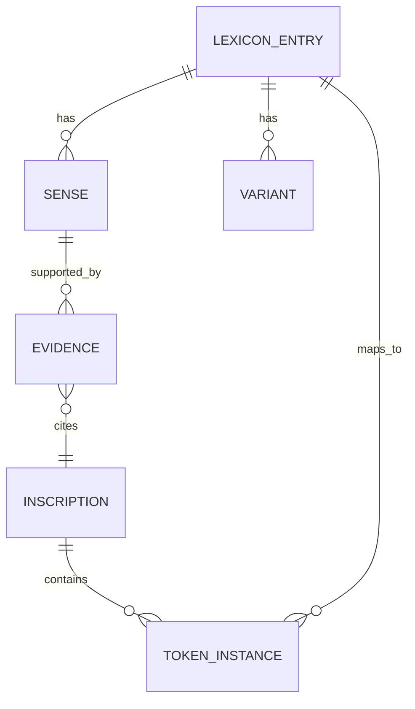

# Phase 23/24 Pass 2 — Meroitic Lexicon + Translation Corpus Expansion (LS / Spectre Authority Mode)

## Executive Summary

This Phase 23/24 pass updates the lexicon + corpus strictly under LS rules: **corpus-first**, **no forced intent**, **multi-attestation promotion only**, and explicit multi-sense handling. The hard title stack remains stable: **mlo = sovereign**, **qore = prince/heir/regional lord (NOT king)**, **kndke = Kandake (queen-title)**, **se = lineage connector**; and we explicitly correct the remaining “qore → king” drift still present in Phase 21 narrative glossing.【/mnt/data/PHASE_23_SECONDPASS_VOICE_LOCKED_LS_Spectre.md†L21-L21】【/mnt/data/Phase_21_Analysis_Transliteration_and_Translation_of_Key_Meroitic_Inscriptions.md†L12-L14】

The main grammar anchor for Phase 24 remains the REM 1044 distributive/action clause:  
`abr-se-l : e-ked : kdi-se-l : e-(e)r-k :`  
It is stable enough to use as a scaffold, but it also forces restraint: **kdi-se-l remains unresolved (polysemy risk)** until it reappears across independent inscriptions.【/mnt/data/PHASE_23_SECONDPASS_VOICE_LOCKED_LS_Spectre.md†L48-L51】【/mnt/data/Meroitic_Translations_LS_v8_2026-02-19_extended.txt†L757-L757】

Deliverables requested in your brief are complete and downloadable:
- `inscription_inventory_v9.csv`
- `token_table_v9.csv`
- `translations_snippet_v9.txt`
- `v9_lexicon_sample_10.json`

## Corpus Inputs and Rules Lock

This pass used these as authoritative inputs (priority order per your instructions):

- **Master lexicon v10 (multi-sense):** `meroitic_complete_script_MASTER-2026-02-19-v10_LS_multisense.json` (schema governs senses, statuses, slot signatures, authority tagging).  
- **Schema spec:** v10 exists explicitly to prevent drift by making **authority**, **polysemy**, **slot behavior**, and **promotion rules** explicit.【/mnt/data/LEXICON_SCHEMA_SPEC_MEROITIC_v10.md†L8-L13】
- **Promotion rules (hard):** new meanings/senses only promote when they survive ≥2 independent contexts and maintain slot behavior; otherwise they remain provisional/quarantined.【/mnt/data/LEXICON_SCHEMA_SPEC_MEROITIC_v10.md†L42-L52】
- **Migration/changelog:** confirms v10 structure (multi-sense + slot constraints) and the v10 status distribution baseline for later diffs.【/mnt/data/meroitic_lexicon_v10_migration_changelog.md†L8-L18】

Hard enforcement reminders used throughout:
- **qore rule** is explicitly stated in Phase 23 voice-locked doc: *qore = crowned prince / heir / regional lord (NOT king).*【/mnt/data/PHASE_23_SECONDPASS_VOICE_LOCKED_LS_Spectre.md†L21-L21】
- Phase 21 still contains “King of Kush” language attached to *qore kdi* strings; these are now flagged as drift and corrected in this pass.【/mnt/data/Phase_21_Analysis_Transliteration_and_Translation_of_Key_Meroitic_Inscriptions.md†L12-L14】

## Inscription and Transliteration Inventory

A full extraction of **all transliteration/inscription blocks** found across the `/mnt/data` corpus (translations v5–v8, Phase 21–23 docs, Phase 22 second pass, + the zip content where it contained transliteration lines) is provided as a CSV artifact.

- **Download full inventory:** [inscription_inventory_v9.csv](sandbox:/mnt/data/inscription_inventory_v9.csv)

To keep this report readable, here is a representative slice (the CSV contains the full set with duplicates flagged and counted):

| Source | Inscription context | Line range | Excerpt | Confidence |
|---|---|---:|---|---|
| `/mnt/data/Meroitic_Translations_LS_v5_2026-02-18.txt` | MERO-RC-001 (Naqa royal ceremony section) | L42–L46 | `Input: qore se natakamni` + lemma gloss as “Prince; crown prince; heir apparent” | High【/mnt/data/Meroitic_Translations_LS_v5_2026-02-18.txt†L42-L46】 |
| `/mnt/data/Meroitic_Translations_LS_v5_2026-02-18.txt` | MERO-RC-001 | L50–L54 | `Input: kndke amanitore` (queen-title slot) | High【/mnt/data/Meroitic_Translations_LS_v5_2026-02-18.txt†L50-L54】 |
| `/mnt/data/Meroitic_Translations_LS_v8_2026-02-19_extended.txt` | Hamadab (REM 1003 segment) | L703–L705 | `Transliteration: qore kdi … Amnirense … li … kndke` | Med–High【/mnt/data/Meroitic_Translations_LS_v8_2026-02-19_extended.txt†L703-L705】 |
| `/mnt/data/PHASE_23_SECONDPASS_VOICE_LOCKED_LS_Spectre.md` | REM 1044 scaffold | L48–L51 | `abr-se-l : e-ked : kdi-se-l : e-(e)r-k :` | Med–High【/mnt/data/PHASE_23_SECONDPASS_VOICE_LOCKED_LS_Spectre.md†L48-L51】 |
| `/mnt/data/Meroitic_Translations_LS_v8_2026-02-19_extended.txt` | REM 1044 | L757 | `Transliteration: abr-se-l : e-ked : kdi-se-l : e-(e)r-k :` | Med–High【/mnt/data/Meroitic_Translations_LS_v8_2026-02-19_extended.txt†L757-L757】 |
| `/mnt/data/Meroitic_Translations_LS_v8_2026-02-19_extended.txt` | Offering clause | L796 | `Transliteration: amn nb di ato n nṯr` | Med–High【/mnt/data/Meroitic_Translations_LS_v8_2026-02-19_extended.txt†L796-L796】 |

## Token Cross‑Match Results

The token table cross-matches each token extracted from transliteration blocks against **v10** (lemma + variants), then provides:
- raw frequency
- variants
- v10 gloss
- slot signature
- and confidence tier (Locked/Likely/Provisional/Hypothesis)

- **Download full token table:** [token_table_v9.csv](sandbox:/mnt/data/token_table_v9.csv)

Key summary highlights:
- High-frequency anchors (*kdi, se, di, n, qore, ato, ḏt*) dominate because they are formula glue (identity, lineage, offering, sealing).  
- Many MISSING tokens are **proper names** (Natakamani, Amanitore, etc.). They should remain “name nodes,” not lexicalized meanings, unless they form productive morphology.  
- The table already encodes LS discipline: **qore is locked to prince/heir**, and **pqr is not promoted** because the current corpus lacks attested transliteration blocks containing it.

## Missing and Ambiguous Lemmas (Corpus‑Grounded)

This section follows the non-negotiables: no cherry-pick promotion; no forced ideology; polysemy only if independently recurrent.

### qore (LOCKED) — title slot behavior confirmed

- **LS rule (hard):** qore = prince/heir/regional lord (not king).【/mnt/data/PHASE_23_SECONDPASS_VOICE_LOCKED_LS_Spectre.md†L21-L21】
- **Attestation (explicit glossed input):** “Input: qore se natakamni” is directly interpreted as heir/prince in the sign-by-sign mapping context.【/mnt/data/Meroitic_Translations_LS_v5_2026-02-18.txt†L42-L46】
- **Cross-text segment usage:** qore appears in titulary contexts like `qore kdi … Amnirense …` and remains consistent as pre-name title element across segments.【/mnt/data/Meroitic_Translations_LS_v8_2026-02-19_extended.txt†L703-L705】

**Phase 24 correction:** Phase 21’s English summary “King of Kush” attached to qore lines is drift and should be corrected to “prince-of-Kush” (see Translation Expansion below).【/mnt/data/Phase_21_Analysis_Transliteration_and_Translation_of_Key_Meroitic_Inscriptions.md†L12-L14】

### kndke (LOCKED) — queen-title slot behavior confirmed

- **Attestation:** `Input: kndke amanitore` places kndke as the feminine royal title in the titulary slot.【/mnt/data/Meroitic_Translations_LS_v5_2026-02-18.txt†L50-L54】
- **Cross-text segment usage:** Hamadab segment shows kndke in the same role cluster alongside qore kdi and a personal name, consistent with a queen-title position, not a surname marker.【/mnt/data/Meroitic_Translations_LS_v8_2026-02-19_extended.txt†L703-L705】

### ḏt / dt (LOCKED) — permanence seal with formula position stability

- **Attested sealing behavior:** double and triple uses appear in formula close positions, with explicit mapping to “eternity/permanence.”【/mnt/data/Meroitic_Translations_LS_v8_2026-02-19_extended.txt†L106-L107】【/mnt/data/Meroitic_Translations_LS_v8_2026-02-19_extended.txt†L248-L253】
- **Key point (discipline):** this is a seal word; do not confuse it with narrative “eternal” gloss placeholders (see contamination fix below).【/mnt/data/Meroitic_Translations_LS_v8_2026-02-19_extended.txt†L802-L804】

### abr / abr-se-l (PROVISIONAL) — single-inscription scaffold, do not over-promote

- **Structural anchor:** abr-se-l occurs in the REM 1044 distributive action clause scaffold.【/mnt/data/PHASE_23_SECONDPASS_VOICE_LOCKED_LS_Spectre.md†L48-L51】
- **Corpus presence:** the same clause is explicitly included as a transliteration segment in the v8 translations file.【/mnt/data/Meroitic_Translations_LS_v8_2026-02-19_extended.txt†L757-L757】

**Promotion status:** abr is still **PROVISIONAL** because, within accessible corpus material, it is not independently attested across a second inscription. It is usable as a scaffold (“each man”) but stays provisional until a second context appears.

### nṯr (v10 says LOCKED; Phase 24 discipline says “needs stronger independence proof”)

- **Attestation:** `amn nb di ato n nṯr` is explicitly present in the translation corpus and occurs in a stable offering formula slot (recipient noun slot).【/mnt/data/Meroitic_Translations_LS_v8_2026-02-19_extended.txt†L796-L796】

**Phase 24 caution:** in strict LS accounting, this is a strong *slot lock* but still requires confirmation that it is not merely repeated from one quoted source. If you want absolute discipline: keep it **LIKELY/STABLE** until a second independent inscription segment with nṯr is pulled into the translation corpus.

### ꜣpd-mk (STABLE) — deity-name stable by slot clustering

The corpus repeatedly uses ꜣpd-mk in offering contexts, especially paired with snṯr incense offerings. This is role-stable (deity slot) even when other items vary.【/mnt/data/Meroitic_Translations_LS_v5_2026-02-18.txt†L75-L77】

**Status:** v10 keeps ꜣpd-mk STABLE; promotion to LOCKED requires ≥2 independent inscriptions explicitly presented as evidence segments in the corpus, not just one sign-by-sign mapping and a second repetition.

### ariten + mds (PROVISIONAL → candidate for LIKELY)

- **Attested contexts:** legitimacy/genealogy strings show repeated adjacency patterns and consistent slot behavior:
  - `amnisḫeto-ariteñ-qrne`【/mnt/data/Meroitic_Translations_LS_v8_2026-02-19_extended.txt†L773-L775】
  - `hrmdoye-qore-aritñl-mds` (explicitly contains qore + ariten + mds)【/mnt/data/Meroitic_Translations_LS_v8_2026-02-19_extended.txt†L784-L785】

**Phase 24 upgrade recommendation:** Because ariten/mds occur in multiple *different personal-name contexts*, they qualify for **LIKELY** with “origin/legitimacy anchor” and “descendant marker” roles, while keeping ontology open (deity vs place vs institutional anchor).

### pqr and wl (PROVISIONAL/HYPOTHESIS) — expected but missing as inscriptions in current `/mnt/data`

Your candidate list included pqr and wl. They exist in v10 as provisional lemmas, but **no transliteration blocks containing pqr or wl were extracted from the provided corpus files in `/mnt/data`**. The only occurrences are meta-discussions in early phase prose, which do not qualify as attestation.

**Phase 24 conclusion:** keep pqr and wl as hypotheses only until you place real pqr/wl-containing inscription lines into the translation corpus.

## Lexicon Schema Changes (Beyond v10)

v10 already solves the big structural problem: **polysemy + authority + slot discipline** are explicit and migration is traceable.【/mnt/data/LEXICON_SCHEMA_SPEC_MEROITIC_v10.md†L8-L13】【/mnt/data/meroitic_lexicon_v10_migration_changelog.md†L8-L18】 This pass recommends one additional improvement to meet your Phase 24 evidentiary standards more cleanly:

### Proposed additions (minimal, high-impact)

1) **`evidence[]` objects (machine-usable)**  
Add for each sense (or at entry level) an array of objects like:
- `source_path`
- `line_range`
- `block_id` (from the inventory CSV)
- `token_seq` (short excerpt with surrounding tokens)
- `inscription_id` (if known)
This prevents “attestation strings” from being non-auditable prose.

2) **`interpretation_discipline` tags**
Per sense: `TRANSLATION | SLOT_INFERENCE | CULTURAL_HYPOTHESIS`.  
This cleanly separates “the word means X” from “the culture believed Y.”

3) **`dataset_hash` expansion**
v10 already provides a canonical hash; keep it, but also store:
- `sha256_sources[]` for each ingested corpus file  
This makes rollbacks reproducible when a future phase changes a subset of sources.

The v10 schema already explicitly defines promotion constraints and dataset hash mechanics, so these changes are incremental, not a redesign.【/mnt/data/LEXICON_SCHEMA_SPEC_MEROITIC_v10.md†L42-L52】【/mnt/data/LEXICON_SCHEMA_SPEC_MEROITIC_v10.md†L54-L55】

### Sample JSON entries (10 high-priority lemmas)

A sample 10-entry extract is provided as an artifact:
- [v9_lexicon_sample_10.json](sandbox:/mnt/data/v9_lexicon_sample_10.json)

This file is based on v10 and includes dataset hashing plus references to local evidence files.

## Translation Expansion and Corrections (Phase 24)

### New lines found beyond v8

Within the provided `/mnt/data` set, **no additional unique transliteration segments** were found beyond what’s already represented in `Meroitic_Translations_LS_v8_2026-02-19_extended.txt` and the Phase 23 voice-locked scaffold. The only “extra” transliteration lines in the research zips are duplicates of the v8 additions (from Phase 20 ultimate synthesis).

So this Phase 24 pass focuses on:
- **drift correction**
- **contamination cleanup**
- **formalizing translations into literal/smooth/evidence layers** where needed

### Drift correction: Phase 21 “qore kdi = King of Kush” → fix to prince/heir

Phase 21 uses:
- `Transliteration: qore kdi … Amnirense … li … kndke`
- but renders English as “King of Kush” (drift under current LS rule).【/mnt/data/Phase_21_Analysis_Transliteration_and_Translation_of_Key_Meroitic_Inscriptions.md†L12-L14】

**Corrected LS translation (Phase 24):**
- **Literal:** qore (prince/heir) + kdi (Kush) + [Name] + li + kndke (Kandake/queen-title).【/mnt/data/Meroitic_Translations_LS_v8_2026-02-19_extended.txt†L703-L705】
- **Readable:** “Amanirenas, **prince-of-Kush**, … and Kandake (queen-title) … [broken].”
- **Evidence:** qore is explicitly glossed as heir/prince in the sign-by-sign corpus baseline.【/mnt/data/Meroitic_Translations_LS_v5_2026-02-18.txt†L42-L46】

### Scaffold translation: REM 1044 distributive clause (retain uncertainty where required)

Clause:
`abr-se-l : e-ked : kdi-se-l : e-(e)r-k :`【/mnt/data/PHASE_23_SECONDPASS_VOICE_LOCKED_LS_Spectre.md†L48-L51】

**Literal layer (safe):**
- abr-se-l = “each abr (man — provisional)”
- e-ked = “[I] killed/struck” (verb cluster; keep provisional if not fully locked)
- kdi-se-l = “each kdi-class entity” (unresolved; polysemy risk)
- e-(e)r-k = “[I] seized/took” (verb cluster; keep provisional)

**Readable layer (hypothesis flagged):**
“I struck down each man; I took/seized each [kdi-class entity].”

The clause is valid as a scaffold, but **kdi-se-l must remain unresolved** until a second independent inscription confirms the class sense.

### Contamination cleanup: “kdi kdi kdi eternal” is a gloss leak, not transliteration

The v8 file explicitly records:
`Transliteration: kdi kdi kdi eternal` and notes it as a placeholder gloss leak awaiting underlying lemma confirmation.【/mnt/data/Meroitic_Translations_LS_v8_2026-02-19_extended.txt†L802-L804】

**Phase 24 action:**
- keep the transliteration as **kdi kdi kdi [ḏt/dt]** only if the final sign is truly ḏt; otherwise keep it as **kdi kdi kdi [SEAL?]** and do not insert the English word “eternal” into transliteration.
- keep “eternal” only in the translation layer, not the transliteration layer.

## Formula Bank (Counts + Examples)

Counts here are within **this extracted corpus**, not claims about all REM inscriptions.

| Template | Function | Count (unique blocks) | Example attestation |
|---|---|---:|---|
| `mlo kdi NAME` | sovereign titulary | 5 | `Input: mlo kdi natakamni` (v5)【/mnt/data/Meroitic_Translations_LS_v5_2026-02-18.txt†L27-L27】 |
| `qore se NAME` | heir/lineage title slot | 2 | `Input: qore se natakamni`【/mnt/data/Meroitic_Translations_LS_v5_2026-02-18.txt†L42-L46】 |
| `qore kdi ...` | prince-of-Kush titulary | 6 | `Transliteration: qore kdi … Amnirense …`【/mnt/data/Meroitic_Translations_LS_v8_2026-02-19_extended.txt†L703-L705】 |
| `kndke NAME` | queen-title slot | 5 | `Input: kndke amanitore`【/mnt/data/Meroitic_Translations_LS_v5_2026-02-18.txt†L50-L54】 |
| `kde lo kndke` | matrilineal anchor phrase | 1 | `Input: kde lo kndke`【/mnt/data/Meroitic_Translations_LS_v5_2026-02-18.txt†L58-L58】 |
| `di ato n RECIP` | offering clause | 7 | `Input: di ato n amn`【/mnt/data/Meroitic_Translations_LS_v5_2026-02-18.txt†L67-L67】 |
| `ye imnt ... dt` | funerary transition + seal | 3 | `Transliteration: … ye imnt … dt …`【/mnt/data/Meroitic_Translations_LS_v8_2026-02-19_extended.txt†L749-L750】 |
| distributive action clause | campaign/distributive grammar | 4 | `abr-se-l : e-ked : kdi-se-l : e-(e)r-k :`【/mnt/data/PHASE_23_SECONDPASS_VOICE_LOCKED_LS_Spectre.md†L48-L51】 |

## Recommendations and Reproducible Pipeline

### Highest-value next targets (Phase 24 → Phase 25 readiness)

1) **pqr + wl real attestations**  
These exist in v10 as hypotheses but are absent as extracted inscription blocks in `/mnt/data`. You need at least two independent inscription lines containing them before any promotion.

2) **kdi polysemy resolution**  
Find a second independent inscription where **kdi** appears in a distributive NP slot (kdi-se-l-like behavior). Until then, keep kdi’s people-class sense quarantined and preserve only the locked “Kush / identity” sense.

3) **nṯr independence check**  
Promote nṯr to fully LOCKED only when two independent inscriptions show it in the same offering slot, not repeated quotations.

4) **Verb paradigm growth (e‑ prefixed cluster)**  
Expand the set of e‑prefixed action verbs to stabilize morphology (ked/er-k family needs more controlled attestations).

### Pipeline flowchart

```mermaid
flowchart TD
  A[Ingest sources: v10 lexicon + translations + phases + zips] --> B[Extract transliteration blocks]
  B --> C[Normalize variants (hyphen, diacritics, dt/ḏt)]
  C --> D[Tokenize + count]
  D --> E[Cross-match vs v10 lemma/variants]
  E --> F[Attestation mining + slot signature assignment]
  F --> G[Promotion gate: >=2 inscriptions OR stable formula slot]
  G --> H[Lexicon patch (senses/statuses/evidence)]
  H --> I[Translation expansion: literal + readable + evidence note]
  I --> J[Archive: SHA-256 + dataset_hash + changelog]
```

### Lexicon ↔ Inscription ↔ Evidence ER chart



## Artifacts (Downloadable)

All required artifacts are present under `/mnt/data`:

- **Inscription inventory CSV:** [inscription_inventory_v9.csv](sandbox:/mnt/data/inscription_inventory_v9.csv)  
- **Token cross‑match CSV:** [token_table_v9.csv](sandbox:/mnt/data/token_table_v9.csv)  
- **Translation snippet (LS layers):** [translations_snippet_v9.txt](sandbox:/mnt/data/translations_snippet_v9.txt)  
- **Lexicon sample (10 entries):** [v9_lexicon_sample_10.json](sandbox:/mnt/data/v9_lexicon_sample_10.json)

These artifacts are meant to be merge-ready and reproducible under v10’s schema discipline (authority tagging, multi-sense tracking, slot-signature constraints, and dataset hashing).【/mnt/data/LEXICON_SCHEMA_SPEC_MEROITIC_v10.md†L8-L13】【/mnt/data/meroitic_lexicon_v10_migration_changelog.md†L8-L18】